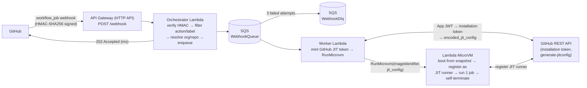
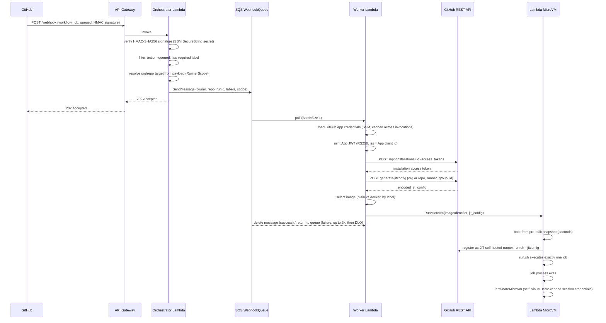

# GitHub Ephemeral Runner Orchestrator

Ephemeral, single-use GitHub Actions self-hosted runners on [AWS Lambda MicroVMs](https://docs.aws.amazon.com/lambda/latest/dg/microvms-how-it-works.html), provisioned on demand by a GitHub webhook and deployed with plain **AWS CloudFormation**.

When a workflow needs a runner, GitHub sends a `workflow_job` webhook. A fresh MicroVM boots from a pre-built snapshot in a few seconds, registers itself with GitHub as a [just-in-time (JIT) runner](https://docs.github.com/en/rest/actions/self-hosted-runners#create-configuration-for-a-just-in-time-runner-for-an-organization), runs **exactly one job**, and self-terminates. There are no long-lived runners, no shared state between jobs, and no idle compute.

This project is a AWS's own [Lambda MicroVMs documentation](https://docs.aws.amazon.com/lambda/latest/dg/microvms-how-it-works.html) and [aws/agent-toolkit-for-aws's `aws-lambda-microvms` skill](https://github.com/aws/agent-toolkit-for-aws/blob/main/skills/specialized-skills/serverless-skills/aws-lambda-microvms/SKILL.md), with one addition:

- **Both org-level and repo-level runners**, selected with a single `RunnerScope` parameter — the reference implementation only supports organization-level runners.
## Architecture



End-to-end sequence, including the parts that matter for debugging (which stage minted which token, when the MicroVM terminates itself and how):



1. **GitHub** sends a `workflow_job` webhook (HMAC-SHA256 signed) when a job is queued.
2. **API Gateway** (HTTP API) exposes `POST /webhook` and invokes the Orchestrator Lambda.
3. **Orchestrator Lambda** verifies the webhook signature, filters for queued `workflow_job` events carrying the required label, resolves the org/repo to register against, and enqueues a runner request. It responds in milliseconds so GitHub's webhook delivery never blocks on provisioning.
4. **SQS** decouples acceptance from provisioning and gives you retries plus a dead-letter queue for requests that fail 3 times.
5. **Worker Lambda** consumes the queue, mints a [JIT runner token](https://docs.github.com/en/rest/actions/self-hosted-runners) from your GitHub App, and calls `RunMicrovm`.
6. **Lambda MicroVM** boots from a pre-built snapshot (seconds, not minutes), registers with GitHub as a JIT self-hosted runner, executes the single workflow job, and calls `TerminateMicrovm` on itself when the job process exits.

## Project layout

```
cloudformation/
  01-foundation.yaml     Phase A: S3 code bucket + MicroVM build role (always deployable)
  02-microvm-images.yaml Phase A2: both MicroVM runner images (AWS::Lambda::MicrovmImage)
  03-orchestrator.yaml   Phase B: SQS, MicroVM execution role, both Lambdas, API Gateway
lambda/
  orchestrator/          Webhook receiver (index.js, filter.js)
  worker/                JIT token mint + RunMicrovm (index.js, github.js, microvms.js)
microvm/
  Dockerfile.base        Plain runner image (no Docker)
  Dockerfile.docker      Docker-in-Docker runner image
  app.js                 Lifecycle hook server baked into both images (port 9000)
  entrypoint.sh          Passes the JIT config to the GitHub Actions runner's run.sh
scripts/
  00-create-ssm-params.sh       Create the two required SSM SecureString parameters
  01-deploy-foundation.sh       Deploy 01-foundation.yaml
  02-package-lambdas.sh         Zip + upload both Lambda functions
  03-deploy-microvm-images.sh   Upload the MicroVM code artifact(s) and deploy 02-microvm-images.yaml
  04-deploy-orchestrator.sh     Deploy 03-orchestrator.yaml
```

## How the MicroVM images are built

Both MicroVM runner image flavors are `AWS::Lambda::MicrovmImage` resources in `cloudformation/02-microvm-images.yaml` — ordinary CloudFormation, same as everything else in this project. `scripts/03-deploy-microvm-images.sh` zips the Dockerfile + `app.js` + `entrypoint.sh` for each flavor, uploads it to S3 under a content-hashed key, discovers the current version of the AWS-managed base image, and deploys the stack; CloudFormation itself blocks on `CREATE_COMPLETE`/`UPDATE_COMPLETE` until each image finishes building (several minutes each), so there is no separate polling step to run.

Re-running `./03-deploy-microvm-images.sh` after changing `microvm/app.js`, an `entrypoint.sh`, or a Dockerfile picks up the change automatically: the content hash in the S3 key changes, CloudFormation sees a new `CodeArtifact.Uri` value, and updates the corresponding image in place (same image ARN, new version).

## Prerequisites

- AWS CLI v2, configured with credentials for the target account/region.
- Confirm **Lambda MicroVMs is available in your target region**: `aws lambda-microvms list-managed-microvm-images`. This is a new service; it is not in every region yet.
- `jq`, `zip`, `npm`/Node.js 22+ locally (only used to package the worker Lambda's `node_modules`).
- A GitHub App (see below) — GitHub does not let a plain Personal Access Token mint JIT runner tokens.

## Deploy walkthrough

```bash
cd scripts

# 0. Create the GitHub App first (see "Create a GitHub App" below), then:
GITHUB_APP_CLIENT_ID=Iv1.xxxxxxxx \
GITHUB_APP_INSTALLATION_ID=12345678 \
PRIVATE_KEY_PATH=/path/to/app-private-key.pem \
./00-create-ssm-params.sh

# 1. Foundation stack (S3 bucket + MicroVM build role)
./01-deploy-foundation.sh

# 2. Package + upload both Lambda functions
./02-package-lambdas.sh

# 3. Deploy both MicroVM runner images - CloudFormation blocks until each
#    build finishes (several minutes each)
./03-deploy-microvm-images.sh both

# 4. Deploy the orchestrator (queues, execution role, Lambdas, API Gateway)
RUNNER_SCOPE=organization RUNNER_GROUP_ID=1 ./04-deploy-orchestrator.sh
```

Each script is idempotent and safe to re-run. State (bucket name, image ARNs, webhook URL, etc.) is written to `scripts/.deploy-state.env` and picked up automatically by the next script.

To rebuild an image after changing `microvm/app.js`, an `entrypoint.sh`, or a Dockerfile: re-run `./03-deploy-microvm-images.sh <flavor>` — it uploads the changed artifact under a new content-hashed key and redeploys `02-microvm-images.yaml`, which updates the corresponding image in place (same ARN, new version); then re-run `./04-deploy-orchestrator.sh` (a no-op unless the ARN itself changed, e.g. you renamed the image).

## Create a GitHub App

A GitHub App is required — it's the only way to mint short-lived JIT runner registration tokens without a human's personal token. Create one at **Settings → Developer settings → GitHub Apps → New GitHub App** (org-owned apps: **your org → Settings → Developer settings**).

**One important consequence of using a GitHub App instead of classic per-repo/org webhooks: you do not add a webhook to every repository.** Every GitHub App has exactly one built-in webhook, configured once on the App itself, and GitHub routes events from *every repository (or organization) the App is installed on* to that single URL — this is different from the classic **Repo/Org Settings → Webhooks** UI, where each repo or org needs its own separately-configured webhook. Concretely:

- The webhook **URL and secret are set once**, on the App's own settings page (**Settings → Developer settings → GitHub Apps → your app → Webhook**) — not per repository, not per organization.
- **Installing the App on multiple repositories does not multiply webhooks.** When you install the App, you choose "All repositories" or "Only select repositories" (this choice exists for personal-account installations too, not just orgs) — whichever repos you pick, the same single App-level webhook fires for `workflow_job` events from all of them. Adding a new repo to an existing "All repositories" installation is automatically covered with zero extra webhook configuration; adding one to a "select repositories" installation just means re-opening the installation's settings and adding it to the list — still no new webhook.
- This is independent of `RunnerScope`. `RunnerScope` only controls which GitHub REST endpoint mints the JIT token (`/orgs/{org}/actions/runners/generate-jitconfig` vs `/repos/{owner}/{repo}/actions/runners/generate-jitconfig`) — it has no effect on webhook delivery, since the Orchestrator Lambda already reads `repository.owner.login` / `repository.name` / `organization.login` straight out of whatever payload the single App webhook delivers.

So for "I want this to cover every repo in my account/org," the answer is: install the App with **All repositories** selected (once), keep the App's own webhook pointed at your `WebhookUrl` (once) — that's it, regardless of how many repos exist or how many get added later.

Set `RunnerScope` to match the JIT-token permission you grant the App:

### `RunnerScope=organization` (default)

- **Organization permissions → Self-hosted runners: Read and write**.
- Needs a runner group ID (`RunnerGroupId`, default `1` = the default group). Find yours under **Org Settings → Actions → Runner groups**.
- Calls `POST /orgs/{org}/actions/runners/generate-jitconfig`.
- Only usable if the App is installed under an organization — personal accounts have no org-level runner groups or org JIT endpoint.

### `RunnerScope=repository`

- **Repository permissions → Administration: Read and write**.
- **`RunnerGroupId` is still required** — confirmed against the live GitHub API: omitting it returns `422 missing required key: runner_group_id`, even though repositories (including personal-account ones with no organization at all) have no runner-group UI to look this up in. Leave it at the default `1`, which is the implicit default group every repo has.
- Calls `POST /repos/{owner}/{repo}/actions/runners/generate-jitconfig`.
- Works for personal-account installations, and scales to as many repos as the App is installed on (see above) — this is the scope to use if you don't have an organization, or you want per-repo JIT permission granularity instead of one org-wide grant.

Either way, after installing the App, collect:

- **App client ID** (`Iv1...`) — App settings page.
- **Installation ID** — the numeric ID in the URL after installing the app (`.../settings/installations/<id>`), or `gh api /app/installations`.
- **Private key** — generate one on the App settings page and download the `.pem`.

Feed all three into `scripts/00-create-ssm-params.sh` as shown above.

## Configure GitHub

Because the webhook lives on the App (see above), this is a one-time setup regardless of how many repos you cover. Both steps below happen on the **App's own settings page**, not on any individual repository:

1. Get to the App's settings page: **github.com → your profile picture (top right) → Settings → Developer settings → GitHub Apps** (org-owned app: **your org's page → Settings → Developer settings → GitHub Apps**) → click the App's name (not "Install" — that's the separate install flow in step 5).
2. On the **General** tab (the page you land on), find the **Webhook** section:
   - Check **Active**.
   - **Webhook URL**: the `WebhookUrl` output from `04-deploy-orchestrator.sh` (also in `scripts/.deploy-state.env`).
   - **Webhook secret**: the value `00-create-ssm-params.sh` printed.
   - Scroll down and **Save changes**.
3. In the left sidebar of that same settings page, click **Permissions & events**.
4. Scroll to **Subscribe to events** and check **Workflow jobs**, then **Save changes** at the bottom of the page.
   - If **Workflow jobs** isn't in the list yet, it's because the event is gated on a permission the App doesn't have selected — grant **Repository permissions → Actions: Read-only** further up this same page first, save, then the checkbox appears.
5. Install/reinstall the App on the repositories you want covered (left sidebar → **Install App**) — **All repositories** if you want every current and future repo included with no further action, or **Only select repositories** if you'd rather curate the list explicitly.

There is no separate step for "add a webhook to repo X" — installing the App on repo X (step 5) is the only thing needed for it to start receiving `workflow_job` events through the existing single webhook. Steps 2-4 are one-time, App-wide configuration; you never repeat them per repository.

## Trigger a runner

In a workflow file:

```yaml
jobs:
  build:
    runs-on: [self-hosted, lambda-microvms]        # plain runner image
    # runs-on: [self-hosted, lambda-microvms, docker]  # Docker-in-Docker image
    steps:
      - uses: actions/checkout@v4
      - run: echo hello from a MicroVM
```

`lambda-microvms` (configurable via `RequiredRunnerLabel`) is the label that tells the orchestrator to provision a runner at all; adding `docker` (configurable via `DockerRunnerLabel`) additionally routes the job to the Docker-in-Docker image instead of the plain one.

## Configuration reference

All of these are CloudFormation parameters on `03-orchestrator.yaml` (see the template for full descriptions); the deploy script exposes the common ones as environment variables.

| Parameter | Default | Notes |
|---|---|---|
| `RunnerScope` | `organization` | `organization` \| `repository` |
| `RunnerGroupId` | `1` | Required by GitHub's API for both scopes; leave at `1` for repository scope |
| `RequiredRunnerLabel` | `lambda-microvms` | Must be present for the orchestrator to act at all |
| `DockerRunnerLabel` | `docker` | Routes to the Docker-in-Docker image |
| `MicrovmMaxIdleSeconds` | `1800` | `idlePolicy.maxIdleDurationSeconds` — moot here since the runner self-terminates on job exit, kept as a safety net |
| `MicrovmSuspendedSeconds` | `10` | `idlePolicy.suspendedDurationSeconds` |
| `MicrovmMaxDurationSeconds` | `3600` | Hard ceiling before the platform force-terminates the MicroVM (max `28800` = 8h) |
| `WebhookSecretParamName` | `/github-runner-orchestrator/webhook-secret` | SSM SecureString, created by `00-create-ssm-params.sh` |
| `AppCredentialsParamName` | `/github-runner-orchestrator/app-credentials` | SSM SecureString, created by `00-create-ssm-params.sh` |

## Cost

Per the reference author's numbers: MicroVMs are billed at roughly **$0.0044/minute** for a 2 vCPU / 4 GB instance while running, plus roughly **$1.50/month** per image in snapshot storage. There's no idle compute cost — a runner exists only for the duration of one job. Add the usual (small) SQS/Lambda/API Gateway costs, which are negligible at CI-job volumes.

## Security notes

- The webhook secret, GitHub App private key, installation token, and JIT `encoded_jit_config` are never logged — see the comments in `lambda/orchestrator/index.js`, `lambda/worker/index.js`, and `microvm/app.js`. Error paths that touch the credential-bearing run-hook payload log the error *type* only, never the message, since a JSON/base64 parse error can echo fragments of the offending input.
- `MicrovmBuildRole` and `MicrovmExecutionRole` trust policies are scoped with `aws:SourceAccount` + `aws:SourceArn` conditions (confused-deputy protection), per AWS's documented guidance.
- The runner MicroVM is launched with `NO_INGRESS` (no inbound connectivity at all) and `INTERNET_EGRESS` (unrestricted outbound, matching GitHub-hosted runner behavior). For network-restricted environments, swap `MICROVM_EGRESS_NETWORK_CONNECTORS` in `03-orchestrator.yaml` for a custom VPC egress connector (`aws lambda-core create-network-connector`) and update `WorkerRole`'s `PassNetworkConnectors` statement to include its ARN.

## Webhook ingress security

The one public network entry point in this whole design is `POST /webhook` on API Gateway. Everything downstream of it (SQS, both Lambdas, the MicroVM execution role) has no public exposure at all, so this endpoint is the thing worth reasoning carefully about.

**What already protects it today:** the Orchestrator Lambda verifies the `X-Hub-Signature-256` header against an HMAC-SHA256 computed with the webhook secret (stored as an SSM SecureString, never logged) before it does anything else with the request body — an unsigned or mis-signed request is rejected before it reaches any parsing logic that touches org/repo names or labels. This is the same control GitHub itself recommends and the same one every webhook-based integration GitHub supports relies on, because:

**GitHub has no EventBridge partner event source.** Some CI platforms — Like Buildkite is registered AWS EventBridge SaaS partners, which lets them call `PutPartnerEvents` directly into a customer's AWS account. That genuinely has no webhook and no public endpoint on the customer's side. GitHub does not have this integration for Actions events; there is no partner event bus you can subscribe to instead of receiving a webhook. Confirmed by checking GitHub's own docs and AWS's EventBridge partner catalog — Actions webhooks (HMAC-signed HTTP POST) are the only delivery mechanism GitHub Apps get.

**AWS's "EventBridge for GitHub" Quick Start (2022) is not a webhook-free alternative either.** It's tempting to read the name as "the same thing Buildkite does," but the actual architecture (confirmed via a technical breakdown, not just the announcement) is: a public Lambda Function URL still receives GitHub's webhook POST, a Lambda still verifies the signature against a secret in Secrets Manager, and only *then* does it call `PutEvents` to forward into a custom EventBridge bus. The EventBridge bus there is an internal fan-out/routing layer for consumers downstream of the verification step — it does not remove or replace the public listener. Architecturally that's the same shape as this project's Orchestrator Lambda (API Gateway route instead of a Function URL, but public endpoint → verify signature → hand off to something else). Adding EventBridge here would add a routing layer without shrinking the actual attack surface, so it isn't used.

Two genuine options exist if you want to go further than HMAC verification alone. Neither is implemented in this project yet — recorded here as the evaluated alternatives, so the decision doesn't need to be re-litigated later:

| Option | What it buys you | Tradeoff | Status |
|---|---|---|---|
| **AWS WAF in front of API Gateway**: IP set restricted to [GitHub's published webhook IP ranges](https://api.github.com/meta) (`hooks` key) + a rate-based rule | Blocks unsigned-request floods and scans before they even reach the Lambda invocation (HMAC check still runs as defense-in-depth behind it) | GitHub's IP ranges do change occasionally, so the IP set needs periodic refresh (e.g. a small scheduled Lambda syncing from `/meta`) | Not implemented |
| **Poll instead of receiving a webhook at all**: a scheduled Lambda (EventBridge Scheduler, e.g. every 30-60s) calls `GET /repos/{owner}/{repo}/actions/runs?status=queued` (or the `workflow_job` queued state) and enqueues work exactly like the webhook handler does today | Zero public ingress — closest GitHub-side equivalent to what Buildkite's partner-event model achieves | Added latency between a job queuing and a runner launching (bounded by the poll interval, vs. near-instant with a webhook); adds a small steady drip of GitHub API calls against your rate-limit budget | Not implemented |

Given that the HMAC verification is already the load-bearing control and there's no direct AWS credential exposure on this endpoint, the WAF option is the lower-effort improvement if you want one; the polling option is the right call only if truly zero public ingress is a hard requirement and the added latency is acceptable.

Everything else — the webhook HMAC verification, `workflow_job` filtering, JIT token minting via a GitHub App JWT → installation token → `generate-jitconfig`, the gzip-compressed run-hook payload, and the `/ready` `/run` `/terminate` lifecycle hooks in `microvm/app.js`.

## Cleanup

```bash
cd scripts
aws cloudformation delete-stack --stack-name "${PROJECT_NAME:-github-runner-orchestrator}-orchestrator"
aws cloudformation wait stack-delete-complete --stack-name "${PROJECT_NAME:-github-runner-orchestrator}-orchestrator"

# Delete the MicroVM images stack (may fail if a MicroVM built from these
# images is still running - wait for it to finish and retry)
aws cloudformation delete-stack --stack-name "${PROJECT_NAME:-github-runner-orchestrator}-microvm-images"
aws cloudformation wait stack-delete-complete --stack-name "${PROJECT_NAME:-github-runner-orchestrator}-microvm-images"

# 01-foundation.yaml's S3 bucket is DeletionPolicy: Retain - empty then delete it manually if you want it gone
aws s3 rm "s3://$CODE_BUCKET_NAME" --recursive
aws cloudformation delete-stack --stack-name "${PROJECT_NAME:-github-runner-orchestrator}-foundation"
```

## References
- [AWS Lambda MicroVMs — core concepts](https://docs.aws.amazon.com/lambda/latest/dg/microvms-how-it-works.html)
- [AWS Lambda MicroVMs — IAM and security](https://github.com/aws/agent-toolkit-for-aws/blob/main/skills/specialized-skills/serverless-skills/aws-lambda-microvms/references/iam-and-security.md)
- [AWS Lambda MicroVMs — networking](https://github.com/aws/agent-toolkit-for-aws/blob/main/skills/specialized-skills/serverless-skills/aws-lambda-microvms/references/networking.md)
- [GitHub REST API — self-hosted runners (JIT config)](https://docs.github.com/en/rest/actions/self-hosted-runners)
- [hasithaishere/buildkite-microvm-agent](https://github.com/hasithaishere/buildkite-microvm-agent) — the EventBridge-partner-source comparison referenced in [Webhook ingress security](#webhook-ingress-security-and-why-not-eventbridge)
- [GitHub's published webhook IP ranges](https://api.github.com/meta) (`hooks` key) — for the WAF IP-allowlist option, if implemented later
